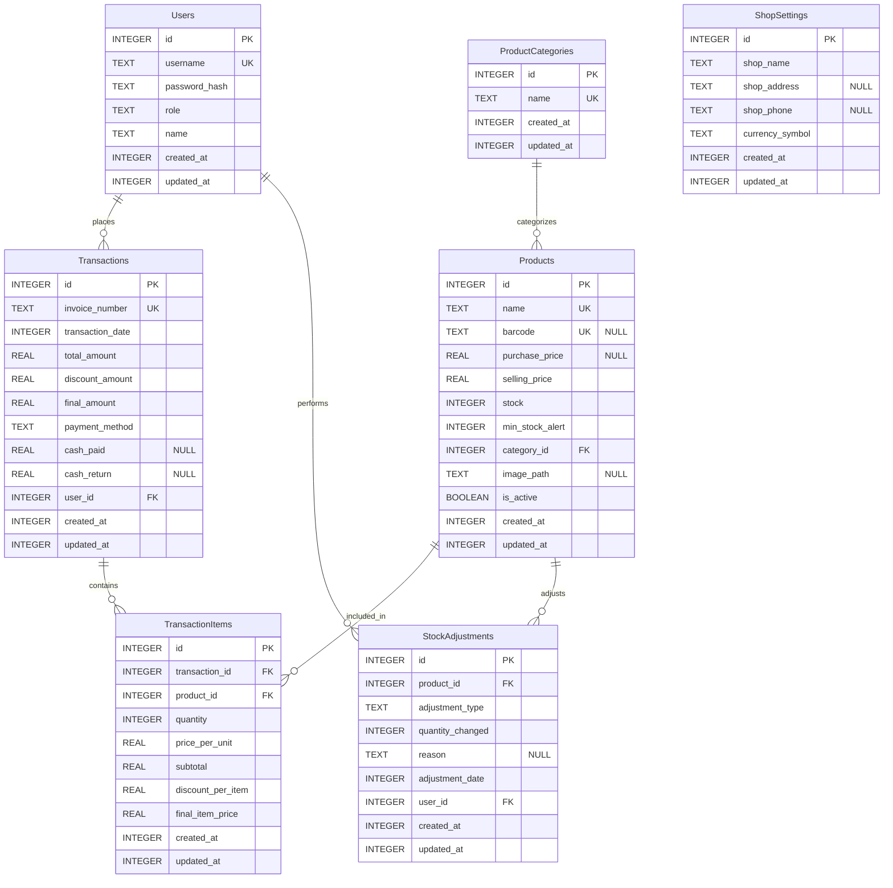

# 📒 Smart Kasir — Aplikasi Kasir Digital Pintar

> **Tagline**: *Solusi kasir digital ringan dan intuitif untuk UMKM. Kelola transaksi, stok, dan laporan penjualan dengan cepat, efisien, dan tanpa ribet.*

---

## 👥 Kelompok
- **Rifqy Niam Fadhil (1241)**
- **Muhammad Ariyanto (1281)**

---

## 📑 Daftar Isi
- [Ringkasan Produk](#ringkasan-produk)
- [Fitur Utama](#fitur-utama)
- [Mengapa Smart Kasir?](#mengapa-smart-kasir)
- [PRD (Product Requirements Document)](#prd-product-requirements-document)
- [ERD & Skema Database](#erd--skema-database)
- [SRS (Software Requirements Specification)](#srs-software-requirements-specification)
- [SDD (Software Design Document)](#sdd-software-design-document)
- [Rencana Sprint (Roadmap MVP 8 Minggu)](#rencana-sprint-roadmap-mvp-8-minggu)
- [Teknologi & Arsitektur](#teknologi--arsitektur)
- [Struktur Proyek (Direktori)](#struktur-proyek-direktori)
- [Instalasi & Menjalankan Proyek](#instalasi--menjalankan-proyek)
- [Kontribusi](#kontribusi)
- [Lisensi](#lisensi)
- [Credit](#credit)

---

## 🧭 Ringkasan Produk

**Smart Kasir** adalah aplikasi kasir digital inovatif untuk UMKM (toko kelontong, kafe/resto kecil, butik, kios, dan retail sejenis). Fokus pada **kemudahan pakai**, **kecepatan transaksi**, dan **pengambilan keputusan berbasis data**. Aplikasi bersifat **offline-first** (Drift/SQLite) dengan opsi sinkronisasi/fitur canggih di fase selanjutnya.

---

## ⭐ Fitur Utama

1. **Transaksi Cepat & Mudah**
   - Keranjang belanja cerdas: tambah produk via pencarian atau *barcode scan* (opsional).
   - Perhitungan otomatis: harga, diskon (per item / total), kembalian.
   - Multi-metode pembayaran: tunai & non-tunai (debit/kredit/QRIS — pencatatan di MVP).

2. **Manajemen Produk & Stok Akurat**
   - Daftar produk lengkap (harga jual/beli, kategori, gambar opsional).
   - Stok otomatis berkurang saat penjualan + penyesuaian manual.
   - Peringatan stok menipis (threshold per produk).

3. **Laporan Penjualan Informatif**
   - Ringkasan omset harian/mingguan/bulanan, jumlah transaksi, diskon, *net sales*.
   - Analisis produk terlaris & jam ramai.
   - Ekspor PDF/Excel (MVP: dasar).

4. **Struk Digital & Fisik**
   - Cetak via printer thermal Bluetooth.
   - Bagikan struk digital (WA/SMS/Email).

5. **Akses Multi-Pengguna Aman**
   - Peran: **owner** (full) & **cashier** (POS & riwayat dirinya).
   - Manajemen akun kasir oleh owner.

6. **Data Aman & Terkelola**
   - Backup & restore **lokal**.
   - **Offline-first** — ideal untuk konektivitas terbatas.

---

## 💡 Mengapa Smart Kasir?
- **Sederhana & Ringan** — UI intuitif, performa ngebut di perangkat entry-level.
- **Efisiensi Waktu** — proses manual terotomasi.
- **Keputusan Berbasis Data** — laporan yang mudah dipahami.
- **Didesain untuk UMKM** — terjangkau, fokus kebutuhan nyata di lapangan.

---

## 📘 PRD (Product Requirements Document)

### 🎯 Visi
Menjadi aplikasi kasir pilihan UMKM Indonesia — komprehensif, mudah digunakan, dan berbasis data.

### 🎯 Tujuan Bisnis
- Tingkatkan efisiensi proses penjualan hingga **30%**.
- Kurangi waktu pencatatan manual & rekap laporan.
- Beri wawasan kinerja produk & tren penjualan.
- Stabil & andal dalam operasional harian.

### 👤 Target Pengguna
- **Primer**: Pemilik UMKM (kelontong, kafe kecil, butik, kios, dsb.).
- **Sekunder**: Kasir.
- **Kebutuhan**: transaksi cepat, stok akurat, laporan mudah, biaya rendah, keamanan data.

### 🔧 Fitur (MVP)
- POS (keranjang, diskon, pembayaran tunai/non-tunai, riwayat).
- Produk & Stok (CRUD, kategori, pengurangan otomatis, penyesuaian, *low stock alert*).
- Laporan dasar (ringkasan & produk terlaris).
- Struk (print Bluetooth).
- Pengguna & Peran (login, owner/kasir).
- Pengaturan Toko (nama toko).
- **Backup lokal**.

Lihat detail FR/NFR di bagian **SRS**.

---

## 🗃 ERD & Skema Database

> Implementasi menggunakan **Drift (SQLite)**. Timestamp disimpan sebagai `INTEGER` (Unix epoch). *BOOLEAN* direpresentasikan `INTEGER (0/1)`.

### 🧩 Tabel Utama
- **Users**: `id`, `username` (UNIQUE), `password_hash`, `role('owner'|'cashier')`, `name`, `created_at`, `updated_at`
- **ProductCategories**: `id`, `name` (UNIQUE), `created_at`, `updated_at`
- **Products**: `id`, `name` (UNIQUE), `barcode` (UNIQUE, NULL), `purchase_price?`, `selling_price`, `stock`, `min_stock_alert(5)`, `category_id?`, `image_path?`, `is_active(1)`, `created_at`, `updated_at`
- **Transactions**: `id`, `invoice_number` (UNIQUE), `transaction_date`, `total_amount`, `discount_amount(0)`, `final_amount`, `payment_method('cash'|'non_cash')`, `cash_paid?`, `cash_return?`, `user_id`, `created_at`, `updated_at`
- **TransactionItems**: `id`, `transaction_id`, `product_id`, `quantity`, `price_per_unit`, `subtotal`, `discount_per_item(0)`, `final_item_price`, `created_at`, `updated_at`
- **StockAdjustments**: `id`, `product_id`, `adjustment_type('add'|'remove')`, `quantity_changed`, `reason?`, `adjustment_date`, `user_id`, `created_at`, `updated_at`
- **ShopSettings**: `id`, `shop_name`, `shop_address?`, `shop_phone?`, `currency_symbol('Rp')`, `created_at`, `updated_at`

### 🗺️ ERD (Mermaid)

> *Tip:* Gunakan ekstensi Mermaid di GitHub atau *renderer* bawaan untuk menampilkan diagram.

---

## 🧪 SRS (Software Requirements Specification)

### ✅ Persyaratan Fungsional (ringkas)
- **Auth & Role**: Login/Logout, peran **owner/cashier**, CRUD kasir (oleh owner).
- **Produk**: List + pencarian/filter, CRUD produk & kategori, soft delete.
- **Stok**: Pengurangan otomatis saat transaksi, penyesuaian manual, peringatan stok menipis.
- **POS**: Kelola keranjang, diskon item/total, tunai/non-tunai, kembalian, simpan transaksi.
- **Laporan**: Ringkasan (omset, jumlah transaksi, total diskon, net sales), produk terlaris, ekspor PDF/Excel.
- **Struk**: Cetak Bluetooth, bagikan via WA/SMS/Email (teks/PDF).
- **Pengaturan Toko**: Nama, alamat, telepon, mata uang.
- **Manajemen Data**: Backup/restore **lokal**.

### ⚙️ Non-Fungsional
- **Performa**: aksi < 1s; pencarian < 500ms (≤ 1.000 produk).
- **Keamanan**: password **hash** (bcrypt/Argon2); otorisasi per peran; proteksi data lokal.
- **Usability**: intuitif, minim ketukan, konsisten.
- **Reliabilitas**: stabil, error handling *graceful*, konsistensi data.
- **Portabilitas**: Android ≥ 7.0; iOS ≥ 12.0.
- **Maintainability**: clean code, dokumentasi memadai.
- **Skala Internal**: hingga 10.000 produk & 100.000 transaksi.

---

## 🧱 SDD (Software Design Document)

### 🏗️ Arsitektur (Clean Architecture + Riverpod)
- **Presentation**: Flutter UI, Pages/Screens, Riverpod Providers/Notifiers.
- **Domain**: Entities (Freezed), Use Cases, Repository (abstrak).
- **Data**: Repository (implementasi), Data Sources (Drift), Models/DTO (Freezed).
- **Common/Core**: constants, failures, utils, logger, types (Either/fpdart).

### 🔀 Routing (go_router)
- Routes bernama: `/login`, `/dashboard`, `/products`, `/products/add`, `/products/:id/edit`, `/transactions`, `/reports`, `/settings`.

### 🗂️ DAO/Drift
- Tiap entitas memiliki `Table`, `Dao` (CRUD + query khusus).
- `AppDatabase` mengelola koneksi.

### 🧵 State (Riverpod)
- `Notifier/AsyncNotifier` untuk state kompleks (contoh: `CartNotifier`, `ProductListNotifier`).
- Provider untuk injeksi dependensi (repository/use case).

---

## 🗺️ Rencana Sprint (Roadmap MVP 8 Minggu)

> **Durasi**: 4 sprint × 2 minggu. Target: MVP siap uji & rilis awal.

### Sprint 1 — Fondasi & Auth
- Init Flutter, Drift, Riverpod Generator, Go Router, Freezed, Logger.
- Tabel: `Users`, `ShopSettings`; DAO & repository auth/settings.
- Use case: Login, CreateUser (kasir), UpdateShopSettings.
- UI: Login, Setup Toko, Dashboard (placeholder).
- **Testing**: unit (use case/repo/DAO), widget (Login).

### Sprint 2 — Produk & Stok
- Tabel: `ProductCategories`, `Products`; DAO & repo.
- Use case: Add/Get/Update/Delete Product, UpdateStock, Category CRUD.
- UI: Daftar Produk (search+filter), Form Tambah/Edit, Low Stock alert.
- **Testing**: unit & widget terkait produk.

### Sprint 3 — POS & Riwayat Transaksi
- Tabel: `Transactions`, `TransactionItems`; DAO & repo.
- Use case: `ProcessSale`, `GetTransactions`, `GetTransactionDetail`.
- UI: POS (keranjang, total, diskon, bayar), Riwayat Transaksi.
- **Testing**: unit (ProcessSale), widget (POS).

### Sprint 4 — Laporan, Struk, Backup
- Use case: Sales Summary, Best Sellers, Backup/Restore DB.
- Integrasi cetak Bluetooth & share struk (WhatsApp/SMS).
- UI: Laporan, Backup/Restore.
- **Testing**: unit & E2E alur utama; performa, kompatibilitas perangkat.
- **Rilis**: ikon, splash, build Android (AppBundle/APK), iOS (TestFlight).

---

## 🧰 Teknologi & Arsitektur

- **Platform**: Android (utama), iOS.
- **Framework**: Flutter (Dart).
- **State Management**: Riverpod Generator.
- **Models**: Freezed.
- **Navigasi**: go_router.
- **Database Lokal**: Drift (SQLite).
- **Error Handling**: fpdart (Either).
- **Logging**: logger.
- **Offline-First**: penuh; opsi sinkronisasi di masa depan.

---

## 🧱 Struktur Proyek (Direktori)

```
lib/
├── core/
│   ├── constants/
│   ├── errors/            # Failure, error_handler
│   ├── usecases/          # base_usecase.dart
│   └── utils/             # logger_util.dart, extensions
├── features/
│   ├── auth/
│   │   ├── data/          # datasources, models, repositories (impl)
│   │   ├── domain/        # entities, repositories (abstract), usecases
│   │   └── presentation/  # providers, pages, widgets
│   ├── product/
│   ├── pos/
│   ├── reports/
│   └── settings/
├── router/                # go_router_config.dart
├── shared/                # widgets, styles, themes
└── main.dart
```

---

## ⚙️ Instalasi & Menjalankan Proyek

> Pastikan **Flutter SDK** terpasang dan *device/emulator* siap.

```bash
# 1) Clone repo
git clone https://github.com/<org-atau-username>/smart-kasir.git
cd smart-kasir

# 2) Install dependencies
flutter pub get

# 3) Generate code (Freezed/Riverpod)
dart run build_runner build --delete-conflicting-outputs

# 4) Jalankan aplikasi
flutter run
```

**Opsional (Dev Tools):**
- Hot-reload/hot-restart untuk iterasi UI cepat.
- `dart run build_runner watch` saat pengembangan.

---

## 🤝 Kontribusi

Kontribusi sangat terbuka!

1. Fork & buat branch fitur: `feat/nama-fitur`.
2. Tulis test yang relevan.
3. Pastikan lulus linter & test.
4. Buat PR dengan deskripsi jelas (lampirkan *screenshots* bila perlu).

---

## 📄 Lisensi

Disarankan menggunakan lisensi **MIT** (atau sesuai kebutuhan proyek). Tambahkan file `LICENSE` di root repo.

---

## 🙌 Credit

Dibuat oleh **Kelompok FinNote – Rifqy Niam Fadhil (1241) & Muhammad Ariyanto (1281)**.

> Jika butuh **versi bahasa Inggris** atau **pemisahan dokumen (PRD/SRS/SDD) ke folder `docs/`**, beritahu kami — siapin juga *template issue/PR* dan *CI checks* bila diperlukan.
